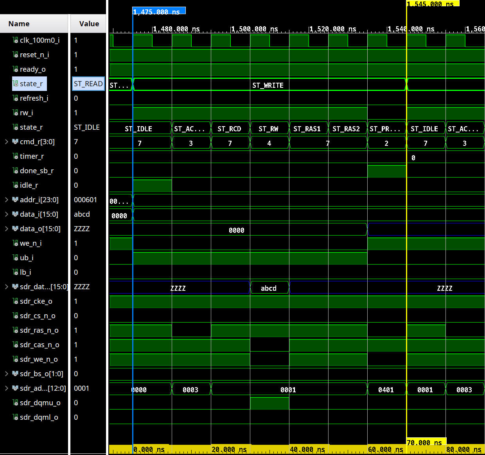
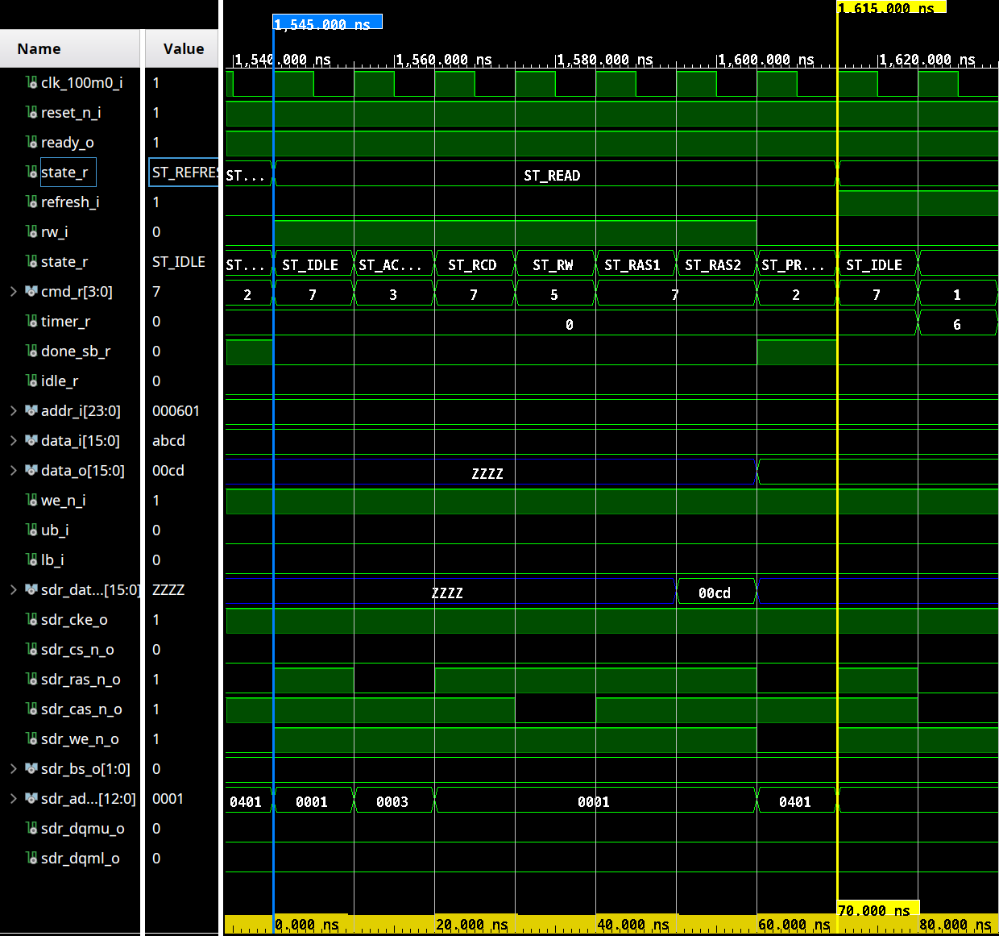
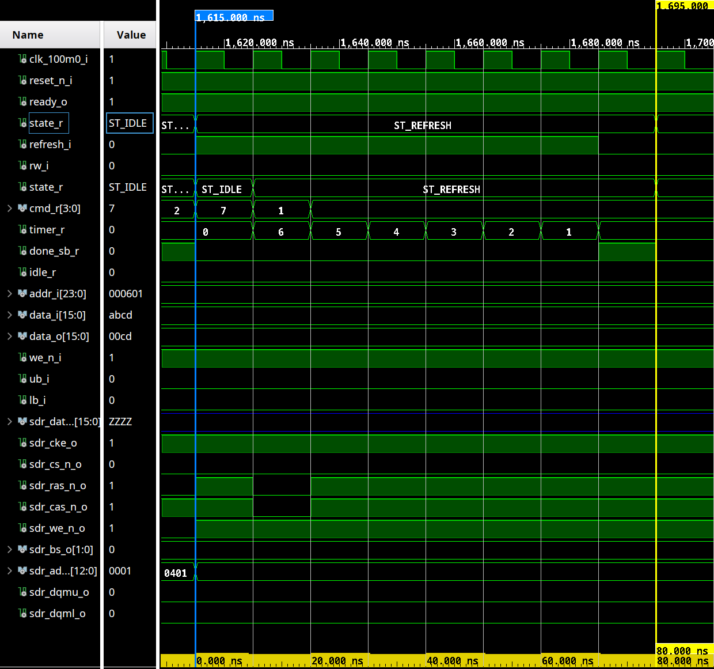

Matthew Hagerty  
Sat, Apr 26, 2014  
Tags: FPGA, VHDL, SDRAM, DDR, memory, electronics  

---

# Simple Fixed-Cycle SDRAM Controller

Code on GitHub: <https://github.com/dnotq/sdram>  
Status: FPGA tested, Xilinx Spartan-6, 100MHz using `Winbond W9825G6JH 4M x 4 Banks x 16-bit SDRAM`

## TL;DR;

Simple SDRAM controller for constant memory access time.  Works very well in FPGA SoC designs using vintage 8-bit and 16-bit CPUs such as the Z80, 6502, TMS-9900, etc..

* 100MHz SDRAM clock
* 70ns read / write access time
* A refresh cycle must be issued at least every 7μs

If you have large data workloads then this controller is probably not what you are looking for; there are already plenty of other SDRAM / DDR controllers out there for that kind of memory access.


## Introduction

This controller was developed while working on a project that uses an 8-bit soft-core CPU (6809).  Because the development board being used has an SDRAM, a simple controller was needed that would allow constant-time random access like SRAM provides.

The 8-bit and 16-bit CPUs present a worst-case scenario for SDRAM, which achieves any high bandwidth by transferring multi-byte data from consecutive memory addresses.  That is all fine and well if you need 32-bit (or wider) data, or are processing chunks of consecutive memory.

However, when all you need is one byte, and the next memory access is going to be somewhere else in memory not anywhere close to the first access, then the burst-access and double-data-rate features go unused.  In is case, all memory access is reduced to always being the worst case access time (about 70ns).  But that is just perfect for an 8-bit CPU running at 10MHz.

Becase SDRAM is still cheaper (around $6.50 for 32MiB at the time of writing) than SRAM, and most FPGA development boards come with some sort of SDRAM on-baord, it is nice to have a simple controller to use when the FPGA’s Block-RAM capacity is not sufficient.


## Design Goals

The controller needed to satisfy these goals:

* Have a constant access time for any read or write to any memory location.
* Controlled refresh cycles to avoid holding up a read or write.
* 8-bit bus width, or 16-bit width with upper / lower byte enables.

After a review of several common SDRAM datasheets it was determined that a random read or write could be performed in 70ns.  That is about 7MiB/sec (read + refresh or write + refresh) and can easily keep up with an 8-bit or 16-bit CPU running at 10MHz or so.

Since most of the 8-bit and 16-bit systems of interest are running around 1MHz to 4MHz, 70ns gives a lot of time to multiplex RAM access between other parts of a system like video generation, sound, ROM, and I/O.

A refresh cycle needs to be issued at least once every 7.2μs to keep the SDRAM from losing its contents.  To keep the refresh cycles from interfering with normal reads or writes, the host system is responsible for issuing refresh cycles.

Since most 8-bit and 16-bit CPUs access memory every few clock cycles (opcode fetch at the very least), a 1MHz CPU will make one memory request every 4μs on average.  Thus, after each CPU cycle where a memory access is performed, a refresh cycle can be issued and easily satisfies the 7.2μs refresh requirement.

For single-byte access the SDRAM must have upper and lower byte enables.  The LS-bit of the address is used to control the UB and LB enables for writes, and controls a byte-select mux for reads.  Since the SDRAM has 16-bit words, the memory can support 8-bit and 16-bit host CPUs directly.


## SDRAM Terminology and Basic Operation

Synchronous Dynamic RAM (SDRAM) stores data in banks, and most modern SDRAMs have multiple banks (four to eight banks seems to be common).  Each bank is configured as x-rows of y-bits (columns).  The number of banks, rows, and bits-per-row (columns) determines the SDRAM’s density.

SDRAM is a _command-based_ memory similar to SPI-flash, SD-cards, etc..  To read or write data, commands are issued to the memory, along with the address and any data being writien.  Due to the way SDRAM stores data (memory cells use a capacitor to store a bit of data as a charge), reading data from a memory cell destroys the value.  Thus, after reading any data, the value has to be written back to the memory cell to restore the data.

To facilitate the restoration of data during normal memory operations, the SDRAM has what are called _sense amplifiers_.  When memory is addressed, the **entire row** of memory containing the requested data is destructively read from the memory bank into the sense amplifiers.

When the read operation is done, the sense amplifiers restore the row of data by writing back to the original memory cells.  If the memory access is a write operation, then the data in the sense amplifiers is replaced with the new values, which are then stored in the memory cells.

Before rows of data can be read from a memory bank into the sense amplifiers for read or write operations, the bank must be _activated_.  Once a bank is active, a row can be retrieved, and read and write commands can be issued against the retrieved data.

When reading and writing is complete, the bank must be closed with a _precharge_ command.  This will write the row back to the memory cells and prepare the sense amps to receive data for the next _activate_ command.  The term _precharge_ can be confusing because it appears to happen **after** the activation and read / write operations.

Basically, after the SDRAM is initialized, the normal command flow would be:

`Activate -> Read / Write -> Precharge`

Since all banks are precharged during initialization, they are ready for activation. The precharge at the end of the sequence commits the row data back to the memory cells and prepares the sense amps for another activate.

The amount of time a bank can remain active is limited, and also depends on the memory address.  Multiple banks can be active at once, which allows greater flexibility and data throughput.  However this kind of bank manipulation is better left to an intelligent memory controller and is beyond the scope of this controller.

There is a minimum amount of time from the activate command to when the row data is ready to be read or written, typicalled called `Trcd`.  There is also a minimum amount of time between activate to precharge (`Tras`), and then from precharge to another activate (`Trp`).

The cumulative time for the SDRAM used in this design is 70ns from activate to activate (`Trc`), which becomes the minimum and fixed access time for the controller.

A refresh cycle is just like a read or write cycle, except the refresh command is issued instead of a read or write command:

`Activate -> Audo Refresh -> Precharge`

Note: During testing it was found that, contrary to original understanding, the refresh requires an 80ns `Trc` to prevent data loss.  Other SDRAM may vary, consult the datasheets for a starting point, then test to ensure reliable operation.

When using the _auto refresh_ command, the SDRAM takes care of determining what row to refresh during a refresh cycles, so keeping the memory refreshed is very straight forward.


## Using the Controller

After power-up the SDRAM needs to be initialized before read or write commands can be issued, and the _mode_ register written to control timing, burst side, etc..  All SDRAMs will have specific requirements, but they all seem very similar:

1. Wait ~200μs with DQM signals high and NOP command issued.
2. Precharge all banks.
3. Issue N refresh cycles.
4. Set mode register.
5. Issue N refresh cycles.

The controller’s host interface is stratight forward:
```vhdl
( clk_100m0_i     : in     std_logic                     -- Master clock
; reset_n_i       : in     std_logic := '0'              -- Reset, active low
; refresh_i       : in     std_logic := '0'              -- Initiate a refresh cycle, active high
; rw_i            : in     std_logic := '0'              -- Initiate a read or write operation, active high
; we_n_i          : in     std_logic := '0'              -- Write enable, active low
; addr_i          : in     std_logic_vector(23 downto 0) -- Address from host to SDRAM
; data_i          : in     std_logic_vector(15 downto 0) -- Data from host to SDRAM
; ub_i            : in     std_logic                     -- Data upper byte write-enable (active low)
; lb_i            : in     std_logic                     -- Data lower byte write-enable (active low)
; ready_o         : out    std_logic := '0'              -- Set to '1' when the memory is ready
; idle_o          : out    std_logic := '0'              -- Set to '1' when ready and idle
; done_sb_o       : out    std_logic := '0'              -- Read, write, or refresh, operation done strobe
; data_o          : out    std_logic_vector(15 downto 0) -- Data from SDRAM to host
```

After reset, the host should wait for `ready_o` to go high, at which time the SDRAM is ready for use.


## Pseudo Example FSM for 8-bit CPU
```vhdl
state_x <= state_r;
rw_i <= '0';
we_i <= '1';
refresh_i <= '0';

addr_i <= addr_r;
data_i <= write_data_r & write_data_r;
data_read_x <= data_read_r;


case state_r is

when ST_IDLE =>
  if cpu_access_tick = '1' then
    if cpu_we_i = '1' then
      state_x <= ST_READ;
    else
      state_x <= ST_WRITE;
    end if;
  end if;

when ST_READ =>
  if done_o = '0' then
    rw_i <= '1';  -- Hold rw_i request until done_o is raised.
  else
    state_x <= ST_REFRESH;
    if addr_r(0) = '0' then
        data_read_x <= data_o(7 downto 0);
    else
        data_read_x <= data_o(15 downto 8);
    end if;
  end if;

when ST_WRITE =>
  if done_o = '0' then
    rw_i <= '1';
    we_i <= '0';
    lb_i <= addr_r(0);
    ub_i <= not addr_r(0);
  else
    state_x <= ST_REFRESH;
  end if;

when ST_REFRESH =>
  if done_o = '0' then
    refresh_i <= '1';
  else
    state_x <= ST_IDLE;
  end if;
```

## Simulation Timing

Write Access


Read Access


Auto Refresh

